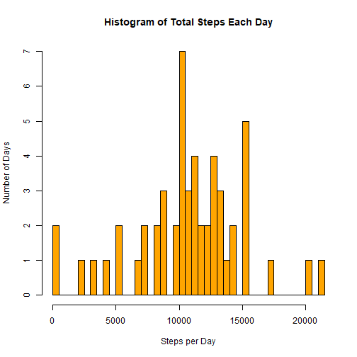
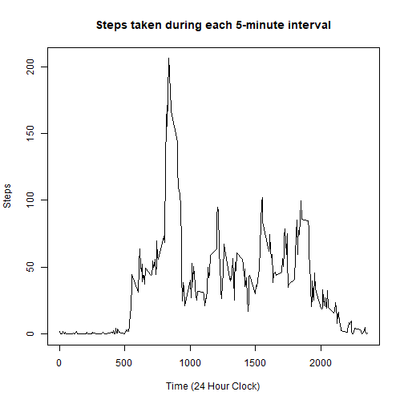
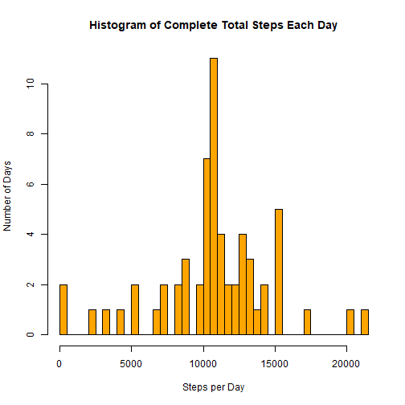
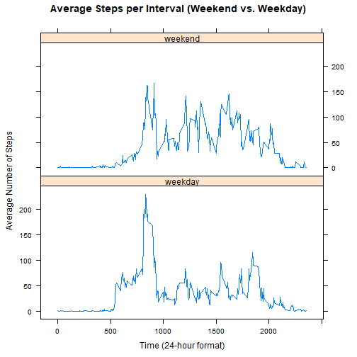

## Loading and preprocessing the da
1. Load the data


```r
steps.df <- read.csv("activity.csv", header = TRUE, stringsAsFactors = FALSE)
head(steps.df)
```

```
##   steps       date interval
## 1    NA 2012-10-01        0
## 2    NA 2012-10-01        5
## 3    NA 2012-10-01       10
## 4    NA 2012-10-01       15
## 5    NA 2012-10-01       20
## 6    NA 2012-10-01       25
```

2. Process/transform the data into a useable format - removing rows containing NA's


```r
steps.NA.rm <- na.omit(steps.df)
head(steps.NA.rm)
```

```
##     steps       date interval
## 289     0 2012-10-02        0
## 290     0 2012-10-02        5
## 291     0 2012-10-02       10
## 292     0 2012-10-02       15
## 293     0 2012-10-02       20
## 294     0 2012-10-02       25
```

## What is the mean TOTAL number of steps taken per day?

1. Calculate the number of steps taken per day


```r
total.steps.per.day <- with(steps.NA.rm, tapply(steps, date, sum))
total.steps.per.day
```

```
## 2012-10-02 2012-10-03 2012-10-04 2012-10-05 2012-10-06 2012-10-07 
##        126      11352      12116      13294      15420      11015 
## 2012-10-09 2012-10-10 2012-10-11 2012-10-12 2012-10-13 2012-10-14 
##      12811       9900      10304      17382      12426      15098 
## 2012-10-15 2012-10-16 2012-10-17 2012-10-18 2012-10-19 2012-10-20 
##      10139      15084      13452      10056      11829      10395 
## 2012-10-21 2012-10-22 2012-10-23 2012-10-24 2012-10-25 2012-10-26 
##       8821      13460       8918       8355       2492       6778 
## 2012-10-27 2012-10-28 2012-10-29 2012-10-30 2012-10-31 2012-11-02 
##      10119      11458       5018       9819      15414      10600 
## 2012-11-03 2012-11-05 2012-11-06 2012-11-07 2012-11-08 2012-11-11 
##      10571      10439       8334      12883       3219      12608 
## 2012-11-12 2012-11-13 2012-11-15 2012-11-16 2012-11-17 2012-11-18 
##      10765       7336         41       5441      14339      15110 
## 2012-11-19 2012-11-20 2012-11-21 2012-11-22 2012-11-23 2012-11-24 
##       8841       4472      12787      20427      21194      14478 
## 2012-11-25 2012-11-26 2012-11-27 2012-11-28 2012-11-29 
##      11834      11162      13646      10183       7047
```

2. Make a histogram of the total number of steps taken each day


```r
hist(total.steps.per.day, breaks = length(total.steps.per.day),
     main = "Histogram of Total Steps Each Day",
     xlab = "Steps per Day", ylab = "Number of Days", col = "orange")
```



3. Calculate and report the mean and median of the total number of steps taken each day


```r
mean.steps <- mean(total.steps.per.day)
paste("The mean number of steps is ", mean.steps)
```

```
## [1] "The mean number of steps is  10766.1886792453"
```

```r
median.steps <- median(total.steps.per.day)
paste("The median number of steps is ", median.steps)
```

```
## [1] "The median number of steps is  10765"
```


## What is the Average Daily Activity Pattern?

1. Make a time series plot (i.e. type = "l") of the 5-minute interval (x-axis) and the average number of steps taken, averaged across all days (y-axis)


```r
mean.steps.per.interval <- with(steps.NA.rm, tapply(steps, interval, mean))
plot(unique(steps.NA.rm[, 3]), mean.steps.per.interval, type = "l",
     main = "Steps taken during each 5-minute interval",
     xlab = "Time (24 Hour Clock)", ylab = "Steps")
```



2. Which 5-minute interval, on average across all the days in the dataset, contains the maximum number of steps?


```r
time.of.max <- steps.NA.rm[which.max(mean.steps.per.interval), 3]
print(paste("On average, the greatest number of steps occurs at ", time.of.max, "(24-hour time-format)"))
```

```
## [1] "On average, the greatest number of steps occurs at  835 (24-hour time-format)"
```

The maximum steps occur around 8:35 AM interpreted from [1] above. 

## Inputing missing values

Note that there are a number of days/intervals where there are missing values (coded as NA). The presence of missing days may introduce bias into some calculations or summaries of the data.

1. Calculate and report the total number of missing values in the dataset (i.e. the total number of rows with NAs)


```r
paste("There are a total of", nrow(steps.df) - nrow(steps.NA.rm), "missing values out of", nrow(steps.df), "data points recorded")
```

```
## [1] "There are a total of 2304 missing values out of 17568 data points recorded"
```

```r
paste("This is ", round((nrow(steps.df)-nrow(steps.NA.rm))/nrow(steps.df)*100, 2), "% of total values.")
```

```
## [1] "This is  13.11 % of total values."
```


2. Devise a strategy for filling in all of the missing values in the dataset. The strategy does not need to be sophisticated. For example, you could use the mean/median for that day, or the mean for that 5-minute interval, etc.

Strategy:
i. Modify above code to store average values for each 5-minute interval in a new data frame called "ls.of.averages".  
ii. Detect rows where NA's occur in column 1 of the original data frame, "steps.df", and replace them with the average value from "ls.of.averages" corresponding to that particular 5-minute interval from column 3 of the same row in "steps.df". 

3. Create a new dataset that is equal to the original dataset but with the missing data filled in.


```r
ls.of.averages <- data.frame(interval = unique(steps.NA.rm[, 3]), 
                             steps = mean.steps.per.interval)
head(ls.of.averages)
```

```
##    interval     steps
## 0         0 1.7169811
## 5         5 0.3396226
## 10       10 0.1320755
## 15       15 0.1509434
## 20       20 0.0754717
## 25       25 2.0943396
```


```r
# Initialize a copy dataframe of steps.df
complete.steps.df <- steps.df

# Replace each NA value in column 1 with the rounded integer average of the respective 5-minute interval
for (i in 1:nrow(steps.df)){
      if (is.na(steps.df[i, 1]))
          complete.steps.df[i, 1] <- 
                  as.integer(round(ls.of.averages[match(steps.df[i, 3], ls.of.averages[, 1]), 2]),0)
}
# Demonstrate that there are no longer NA's present
summary(complete.steps.df)
```

```
##      steps            date              interval     
##  Min.   :  0.00   Length:17568       Min.   :   0.0  
##  1st Qu.:  0.00   Class :character   1st Qu.: 588.8  
##  Median :  0.00   Mode  :character   Median :1177.5  
##  Mean   : 37.38                      Mean   :1177.5  
##  3rd Qu.: 27.00                      3rd Qu.:1766.2  
##  Max.   :806.00                      Max.   :2355.0
```

4. Make a histogram of the total number of steps taken each day and Calculate and report the mean and median total number of steps taken per day. Do these values differ from the estimates from the first part of the assignment? What is the impact of inputing missing data on the estimates of the total daily number of steps?

Calculating total steps per day from the complete steps dataframe.

```r
complete.total.steps.per.day <- with(complete.steps.df, tapply(steps, date, sum))
complete.total.steps.per.day
```

```
## 2012-10-01 2012-10-02 2012-10-03 2012-10-04 2012-10-05 2012-10-06 
##      10762        126      11352      12116      13294      15420 
## 2012-10-07 2012-10-08 2012-10-09 2012-10-10 2012-10-11 2012-10-12 
##      11015      10762      12811       9900      10304      17382 
## 2012-10-13 2012-10-14 2012-10-15 2012-10-16 2012-10-17 2012-10-18 
##      12426      15098      10139      15084      13452      10056 
## 2012-10-19 2012-10-20 2012-10-21 2012-10-22 2012-10-23 2012-10-24 
##      11829      10395       8821      13460       8918       8355 
## 2012-10-25 2012-10-26 2012-10-27 2012-10-28 2012-10-29 2012-10-30 
##       2492       6778      10119      11458       5018       9819 
## 2012-10-31 2012-11-01 2012-11-02 2012-11-03 2012-11-04 2012-11-05 
##      15414      10762      10600      10571      10762      10439 
## 2012-11-06 2012-11-07 2012-11-08 2012-11-09 2012-11-10 2012-11-11 
##       8334      12883       3219      10762      10762      12608 
## 2012-11-12 2012-11-13 2012-11-14 2012-11-15 2012-11-16 2012-11-17 
##      10765       7336      10762         41       5441      14339 
## 2012-11-18 2012-11-19 2012-11-20 2012-11-21 2012-11-22 2012-11-23 
##      15110       8841       4472      12787      20427      21194 
## 2012-11-24 2012-11-25 2012-11-26 2012-11-27 2012-11-28 2012-11-29 
##      14478      11834      11162      13646      10183       7047 
## 2012-11-30 
##      10762
```

Creating the new histogram.


```r
hist(complete.total.steps.per.day, breaks = length(complete.total.steps.per.day),
     main = "Histogram of Complete Total Steps Each Day",
     xlab = "Steps per Day", ylab = "Number of Days", col = "orange")
```



Calculating the mean of the complete steps dataframe.


```r
mean.complete.steps <- mean(complete.total.steps.per.day)
paste("The mean number of steps of the complete steps dataframe is ", round(mean.complete.steps, 2))
```

```
## [1] "The mean number of steps of the complete steps dataframe is  10765.64"
```

```r
paste("This is a change of ", abs(mean.complete.steps-mean.steps), "from before NA's were replaced.")
```

```
## [1] "This is a change of  0.549334982986693 from before NA's were replaced."
```

Calculating the median of the complete steps dataframe.


```r
median.complete.steps <- median(complete.total.steps.per.day)
paste("The median number of steps of the complete steps datafrme is ", median.complete.steps)
```

```
## [1] "The median number of steps of the complete steps datafrme is  10762"
```

```r
paste("This is a change of ", abs(median.complete.steps-median.steps))
```

```
## [1] "This is a change of  3"
```

The impact of replacing missing values in the steps dataframe is very minimal with regards to the mean and median values, however, it had a significant impact on the number of days with the median number of steps, increasing from 7 to 11 days, observable in the histogram.  

# Are there differences in activity patterns between weekdays and weekends?

### For this part the weekdays() function may be of some help here. Use the dataset with the filled-in missing values for this part.

1. Create a new factor variable in the dataset with two levels - "weekday" and "weekend" indicating whether a given date is a weekday or weekend day.


```r
library(dplyr)
day = weekdays(as.Date(steps.df[, 2]))
day.factor = rep(0, length(day))
for (i in 1:length(day)){
      if (day[i] == "Saturday" || day[i] == "Sunday") {
            day.factor[i] = "weekend"
      } else {
            day.factor[i] = "weekday"
      }
}

complete.steps.df <- mutate(complete.steps.df, day = as.factor(day.factor))
```

2. Make a panel plot containing a time series plot (i.e. type = "l") of the 5-minute interval (x-axis) and the average number of steps taken, averaged across all weekday days or weekend days (y-axis). See the README file in the GitHub repository to see an example of what this plot should look like using simulated data.


```r
library(lattice)
weekday.steps <- complete.steps.df[complete.steps.df$day == "weekday", ]
weekend.steps <- complete.steps.df[complete.steps.df$day == "weekend", ]
weekday.average <- round(with(weekday.steps, tapply(steps, interval, mean)))
weekend.average <- round(with(weekend.steps, tapply(steps, interval, mean)))
average.steps = c(weekday.average, weekend.average)
interval = as.numeric(rep(unique(steps.df[, 3]), 2))
days = c(rep("weekday", 288), rep("weekend", 288))
average.df = as.data.frame(cbind(average.steps, interval, as.factor(days)))


xyplot(average.steps ~ interval|days, data = average.df, main="Average Steps per Interval (Weekend vs. Weekday)", xlab="Time (24-hour format)", ylab = "Average Number of Steps", layout=c(1,2), type = "l")
```



